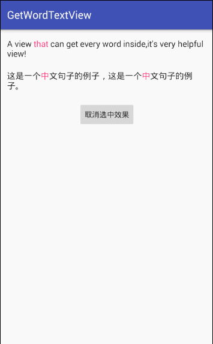

##GetWordTextView

A TextView that can get word in it's content by click,and you can set HighlightText also.
(Support English and Chinese)



##Usage

###Add GetWordTextView to your layout:
```html
  <me.solidev.library.GetWordTextView xmlns:app="http://schemas.android.com/apk/res-auto"
        android:id="@+id/english_get_word_text_view"
        android:layout_width="wrap_content"
        android:layout_height="wrap_content"
        android:textSize="16sp"
        app:highlightColor="@color/colorAccent"
        app:highlightText="that"
        app:language="English"
        app:selectedColor="@color/colorPrimary" />
```
- <code>highlightText</code>:HighlightText
- <code>highlightColor</code>:HighlightText'color
- <code>selectedColor</code>:Clicked word's background
- <code>language</code>:Content's language

###Set Text and Listener in your code
```html
        mEnglishGetWordTextView = (GetWordTextView) findViewById(R.id.english_get_word_text_view);
        mEnglishGetWordTextView.setText("A view that can get every word inside,it's very helpful view!");
        mEnglishGetWordTextView.setOnWordClickListener(new GetWordTextView.OnWordClickListener() {
            @Override
            public void onClick(String word) {
                showToast(word);
            }
        });
```


##TODO
Mixed support for English and Chinese


##Contact & Help

- blog: http://www.jianshu.com/users/6725c8e8194f
- weibo: http://weibo.com/xljiepeng
- email: wy_jiapeng@163.com


##License
```html
Copyright (C) 2016 [_SOLID](https://github.com/burgessjp)

Licensed under the Apache License, Version 2.0 (the "License");
you may not use this file except in compliance with the License.
You may obtain a copy of the License at

    http://www.apache.org/licenses/LICENSE-2.0

Unless required by applicable law or agreed to in writing, software
distributed under the License is distributed on an "AS IS" BASIS,
WITHOUT WARRANTIES OR CONDITIONS OF ANY KIND, either express or implied.
See the License for the specific language governing permissions and
limitations under the License.
```
